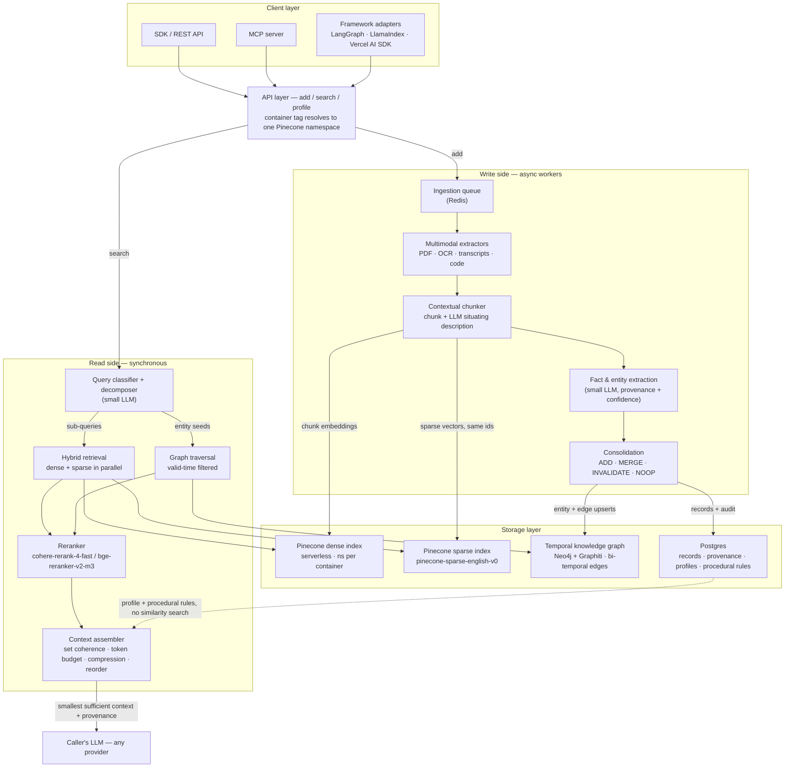
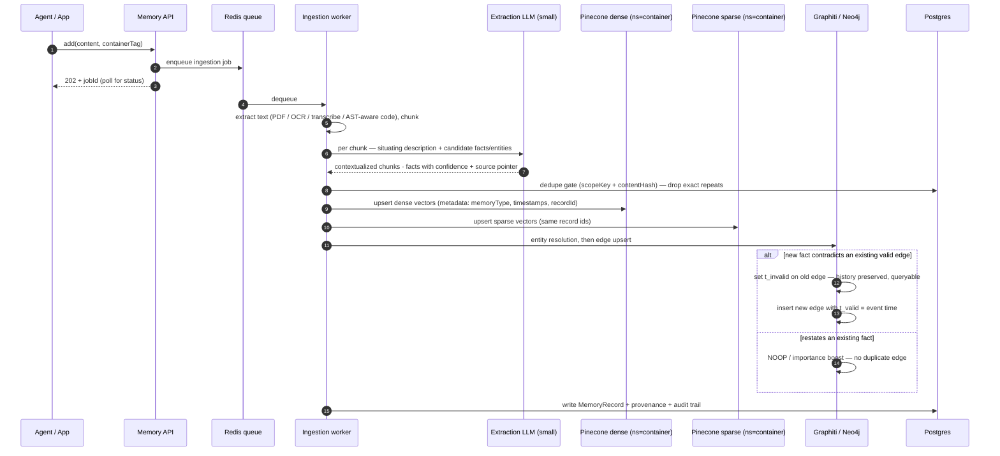
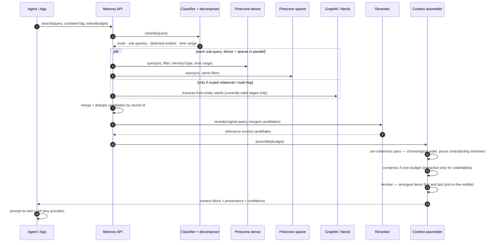
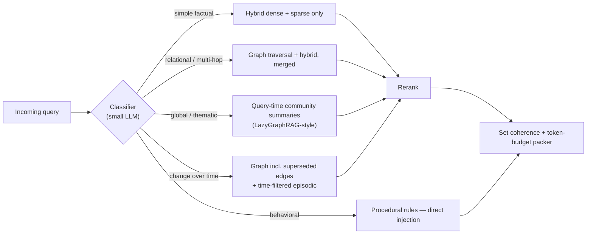
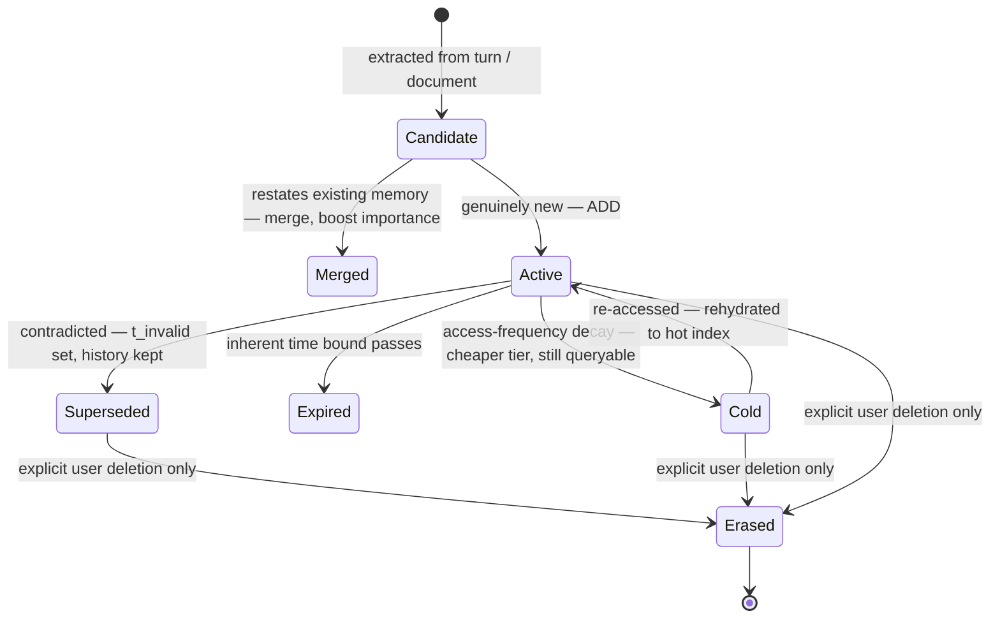

# AI Memory & Context Engine — End-to-End System Flow (v2.1)

> **Partially superseded (2026-08-14):** the first-principles review in [memory-engine-redesign.md](memory-engine-redesign.md) (v3) removes the client/SDK layer, Redis, the ingestion queue, Neo4j+Graphiti (replaced by a Postgres bi-temporal fact table), community summaries, and LLMLingua compression from the target design. Sections 3–7 below describe the v2.1 plan and are kept for the literature analysis and the Exabase evaluation (§9), which remain current.

**Supersedes the storage sections of the v2.0 design doc.** Two changes drive this revision:

1. **Pinecone replaces pgvector** as the vector layer at every tier (it is already what this repo runs — see §8).
2. **Exabase research incorporated.** Their two research posts (M-1 on BEAM, M-1 on LongMemEval) were analyzed in depth; §9 evaluates what transfers into this architecture and what does not.

Date: 2026-08-14 · Status: design · Companion: v2.0 Engineering Design Document (literature review, build-vs-reuse rationale)

---

## 1. What changed since v2.0

| Area | v2.0 | v2.1 |
|---|---|---|
| Vector store | pgvector → Qdrant → Milvus by scale tier (§9.2 of v2.0) | **Pinecone serverless at every tier.** The tiered-migration table is deleted; scaling is namespaces + read capacity, not a database swap |
| Tenant isolation | Payload-filtered vector search | **One Pinecone namespace per container** — physically separated storage per namespace, Pinecone's official multi-tenancy pattern |
| Sparse/keyword search | Self-hosted BM25 index | Pinecone **sparse index** (`pinecone-sparse-english-v0` learned-sparse) or hosted BM25 full-text via document-schema indexes (public preview) |
| Reranking | Voyage rerank-2 / Cohere Rerank 3.5 | Pluggable as before; Pinecone-hosted options now first-class: `cohere-rerank-4-fast`, `bge-reranker-v2-m3`, `pinecone-rerank-v0`. Note **cohere-rerank-3.5 is deprecated** (auto-routed to 4-fast since 2026-08-01) |
| Retrieval scoring | Hybrid dense+sparse → rerank | Adds **temporal salience as a third first-class signal** and **query decomposition** before retrieval (§9.5) |
| Selection | Per-item top-N after rerank | Adds **set-level coherence pass**: chronological ordering + contradiction pruning across the selected set (§9.5) |
| Fully-local topology | Same store self-hosted | **Pinecone cannot be self-hosted.** Local/offline topology uses a swappable adapter (e.g. LanceDB/Qdrant-local) behind the same storage interface; BYOC (data plane in your VPC, public preview) covers data-residency needs |
| Evaluation | LongMemEval + LoCoMo + BEAM | Same, plus mandatory **retrieval-depth curves** (top-10/20/50) and disclosed judge model on every published number (§10) |

Unchanged and still load-bearing: the temporal knowledge graph (Graphiti/Neo4j) for bi-temporal fact versioning, Postgres for records/provenance/profiles/rules, extract→consolidate→retrieve lifecycle, four memory types, token-budget-aware context assembly. Exabase's own published category breakdowns and the BEAM paper's failure-mode analysis both *strengthen* the case for the graph layer — see §9.6.

---

## 2. Concrete component choices

| Component | Choice | Role |
|---|---|---|
| Dense vector index | **Pinecone serverless** (dense index, one namespace per container) | Semantic recall over contextualized chunks |
| Sparse/lexical index | **Pinecone sparse index** — `pinecone-sparse-english-v0`, `dotproduct` | Exact-term recall (names, IDs, jargon) |
| Temporal knowledge graph | **Neo4j + Graphiti** | Entities, relations, bi-temporal validity (`t_valid`/`t_invalid`), non-lossy contradiction handling |
| Relational store | **Postgres (Prisma)** | MemoryRecords, provenance, audit, profiles, procedural rules, job state |
| Queue | **Redis** | Async ingestion pipeline; write load never blocks reads |
| Embeddings | Pluggable: local `bge-small-en-v1.5` (384-dim, ONNX) today; Voyage/Cohere or Pinecone-hosted (`llama-text-embed-v2`, `multilingual-e5-large`) as config | One model per index — a swap requires re-embedding into a new index |
| Reranker | Pluggable: Pinecone-hosted `cohere-rerank-4-fast` (default), `bge-reranker-v2-m3` (free tier), `pinecone-rerank-v0`; external Voyage rerank-2 | Precision stage over merged candidates |
| Extraction / classification LLM | Any cheap fast model (provider-agnostic) | Situating descriptions, fact extraction, query classification & decomposition |
| Compression | LLMLingua-2 class (library) | Final squeeze only; extractive-only for code/tables |

---

## 3. End-to-end overview

Two properties to hold the whole design to:

- **The write side is asynchronous end-to-end.** `add()` returns a job id; extraction/embedding/graph work happens behind the queue. Read latency is never a function of write load.
- **Procedural memory and profiles are injected, not retrieved.** They come straight from Postgres into the assembler — behavior rules must not depend on similarity search finding them.

---

## 4. Write path (ingestion → memory)

Rules that make this path correct:

- **Contextual augmentation happens here, once** — the 50–100-token situating description is prepended before embedding *and* sparse encoding (the highest-leverage retrieval technique in the v2.0 literature review; 35–67% retrieval-failure reduction). Query time pays nothing.
- **Dense and sparse records share ids** so read-side merge/dedupe is a set union, and delete/expiry touches both indexes with the same id list.
- **Chunk text ≤ ~1 KB lives in Pinecone metadata for fast hydration; anything larger lives in Postgres** with only a pointer in metadata (Pinecone metadata is hard-capped at 40 KB/record).
- **Every stored fact carries a source pointer and event timestamp** — the graph's bi-temporal model needs event time (when it became true), not just ingestion time.

---

## 5. Read path (query → context block)

### 5.1 Routing

Routing decisions worth pinning down:

- **Query decomposition is part of classification** (one small-LLM call, not two): multi-part queries are rewritten into parallel sub-queries, each retrieved independently, then merged before reranking. This is the single clearest technique both the LongMemEval paper and Exabase's M-1 credit for multi-session gains (§9.5).
- **Time-range extraction feeds a metadata filter**, not a prompt hint: `{"eventTime": {"$gte": t0, "$lte": t1}}` on both Pinecone queries. The LongMemEval paper measured +7–11% temporal-reasoning recall from exactly this — with the caveat that a weak extractor hallucinating ranges makes it *worse*, so an unconfident extraction must fall back to unfiltered search.
- **Current-state queries see only currently-valid graph edges**; "what changed / what did we believe then" queries flip the flag to include superseded edges. Same store, one flag.
- **Reranking is budgeted, not maximal**: rerank the merged top ~50–100, not everything (hosted rerankers cap at 100–250 docs per call anyway).

---

## 6. Memory lifecycle

Pinecone-specific mechanics (Pinecone has **no built-in TTL** — all lifecycle transitions are jobs this engine owns):

- **Expiry / decay** — a scheduled worker queries Postgres for due records and deletes the corresponding ids from both Pinecone indexes; the Postgres record and graph history remain.
- **Cold tier** — decayed vectors move to a separate cold index (or archive to Parquet in object storage, restorable via Pinecone bulk import; note import cannot target an existing namespace — restores land in a fresh namespace and are re-pointed).
- **Right-to-erasure** — delete the container's namespace in both indexes + graph partition + Postgres rows. Namespace-per-container makes this one bounded operation, not a scan.

---

## 7. What Pinecone changes, concretely

| Design concern | Pinecone primitive | Caveat to design around |
|---|---|---|
| Container isolation | One namespace per container; physically separated storage per namespace | No cross-namespace query — cross-container search (e.g. org-wide over per-user containers) needs fan-out + client-side merge |
| Hybrid search | **Two indexes** (dense + sparse), merged by id, then reranked — "cascading retrieval" | Single-index dense+sparse with alpha-weighting (what this repo does today) still works but sparse scores are unnormalized; the two-index pattern keeps signals independently tunable. Document-schema FTS indexes (real BM25, hosted) are public-preview and **cannot be backed up yet** |
| Lexical encoding | `pinecone-sparse-english-v0` (learned sparse) | English-focused; multilingual tenants need the BM25/document-schema path or client-side encoding. Sparse vectors cap at 2,048 non-zeros/record (current limits page) |
| Reranking | Hosted `/rerank` or inline `rerank` param — no separate service to run | `cohere-rerank-4-fast` scores are **not comparable** to the deprecated 3.5 — recalibrate any stored thresholds |
| Metadata filtering | `$eq/$gt/$in/...` server-side, single-stage filtered ANN | 40 KB/record cap; flat keys only, no nulls — full text beyond ~1 KB belongs in Postgres |
| Time-travel & versioning | **Not provided** — no record versioning | Bi-temporality lives entirely in the graph + Postgres; Pinecone holds only current-embedding state |
| TTL / expiry | **Not provided** | Engine-owned lifecycle workers (§6) |
| Scaling | Serverless; namespaces scale independently; Dedicated Read Nodes (preview) for sustained high QPS | ~100 RPS per namespace baseline — hot tenants may need caching in front |
| Backups / bulk load | Scheduled full-index backups; Parquet import from S3/GCS/Azure | Import can't target an existing namespace; integrated-embedding indexes can't import raw text |
| Self-hosting | **None** (closed source). BYOC preview puts the data plane in your VPC | The v2.0 "fully local/offline" topology now requires the storage-adapter seam: same retrieval interface, local backend (LanceDB / Qdrant-local) for offline; this seam is non-negotiable in the code structure |
| Graph / relational queries | **Not provided** | Neo4j+Graphiti and Postgres carry everything relational — unchanged from v2.0 |

---

## 8. Where this repo already is (grounding)

The CoreAI backend already runs the skeleton of this design — the diagram above is an evolution, not a green-field:

| Target design element | Today in `apps/backend` |
|---|---|
| Pinecone serverless, namespace per tenant | `lib/pinecone-client.ts` — index `memory`, `formatTenantNamespace()` (`biz_*` / `arch_*`) |
| Hybrid dense+sparse | Single dotproduct index, alpha-blend 0.75; custom FNV-1a TF sparse encoder (`modules/memory/sparse-encoder.ts`) |
| Embeddings | Local ONNX `bge-small-en-v1.5`, 384-dim (`modules/ai-provider-engine/embeddings.ts`) |
| Records + dedupe | Postgres `MemoryRecord`, dedupe on `scopeKey + contentHash` (`modules/memory/smart-memory.ts`) |
| Working memory / raw mode | Sub-threshold corpora (`MIN_EMBEDDING_CHARS` = 400 chars) bypass vectors entirely — raw pass-through |
| Context assembly | `modules/memory/context-builder.ts` + `memory-compression.ts` (compact string, node back-links) |

Gap list to reach v2.1 (in order of retrieval-quality leverage): contextual situating descriptions at ingestion → hosted reranker stage → time-range metadata filters + query decomposition → migrate sparse from FNV-1a TF blend to a separate `pinecone-sparse-english-v0` index (cascading pattern) → temporal graph layer → set-coherence pass in assembly.

---

## 9. Exabase research — evaluation

Source: [exabase.io/research](https://exabase.io/research) — two posts, both about **M-1 ("Mneme-1")**, Exabase's proprietary long-term memory engine. Exabase is the developer-platform spin-out of Fabric (consumer AI workspace, ~300K claimed users; $1M pre-seed, Seedcamp); the platform is ~3 months old publicly (BetaList May 2026). M-1's retrieval work is credited to a collaboration with Hyperplane Labs.

### 9.1 What they published

**LongMemEval post** — M-1 scores **96.4%** at top-50 retrieval using **Gemini 3 Flash** as both answering *and judge* model (curve disclosed: 90.8% @ top-10 · 93.4% @ top-20 · 96.4% @ top-50 · 95.4% @ top-200). Compared against Mem0 94.8%, Honcho 92.6%, HydraDB 90.79%, Supermemory 85.2% — all listed with Gemini 3 Pro. Their thesis: *"retrieval architecture, not model scale, is the primary determinant of memory system quality."*

**BEAM post** — on the BEAM benchmark (paper: *"Beyond a Million Tokens: Benchmarking and Enhancing Long-Term Memory in LLMs"*, Tavakoli et al., University of Alberta/Amii + UMass Amherst, ICLR 2026, [arXiv 2510.27246](https://arxiv.org/abs/2510.27246); 10 ability categories, nugget-based 0/0.5/1 LLM-judge scoring, 2,000 human-validated questions across 19 domains): M-1 **76.9% @ 100K · 75.0% @ 1M · 68.0% @ 10M**, ahead of Hindsight (quoted at 73.4/73.9/64.1, Gemini 3 Pro) and Honcho (63.0/63.1/40.6). Claims ~20% fewer tokens per query than the next-best system and up to "86%+" cost advantage (derivation not shown). Note: **there is no official BEAM leaderboard** — the paper's repo maintains none — so "SOTA at every scale" means "highest among vendor self-reports," and Hindsight's own site self-reports **75.0%** at 100K (not the 73.4% Exabase quotes) while still claiming #1 itself.

**Disclosed architecture** (their words, implementation "proprietary"): a three-phase retrieval pipeline —
1. **Candidate scoring** on *semantic similarity + lexical precision + temporal salience* as separate signals;
2. **Query decomposition** — queries "rewritten and decomposed into multiple parallel retrieval passes, each targeting a distinct information need";
3. **Re-ranking** via *importance scoring, temporal chain resolution, and cross-memory coherence*.

The write path (extraction, consolidation, storage layout) is **not disclosed at all**. No graph, no filesystem-as-memory, no vector-DB detail is claimed anywhere in either research post — even though Exabase's *marketing* pages ("not a vector database… a dynamic knowledge graph that evolves") claim a knowledge graph. The marketing claim and the research disclosure are unreconciled; treat the KG claim as unverified.

### 9.2 The BEAM paper itself — the most transferable research on the page

Exabase's BEAM post rides on a genuinely strong peer-reviewed benchmark paper, and the *paper's* findings matter more to this design than the vendor post does:

- **Neither long context nor naive RAG suffices.** Even 1M-token-window models with retrieval augmentation degrade as dialogues lengthen; the paper's structured-memory framework (LIGHT: episodic memory index + working memory + scratchpad + noise filtering) beats the strongest baselines by 3.5–12.7% average — and helps **even when the entire history fits in the context window**. This is the strongest independent confirmation of the v2.0 premise that a 2M window is not a memory strategy.
- **Component ablations at long scale**: removing retrieval −8.5%, noise filtering −8.3%, working memory −5.7%, scratchpad −3.7% — and every component's contribution *grows* with conversation length. Our reranker + set-coherence pass is the "noise filtering" analog; the working-memory tier in the four-type model is directly validated.
- **Sparse retrieval wins at short scales; dense wins at 10M** — a direct argument for keeping both signals independently tunable (the two-index cascading pattern in §7) rather than a fixed alpha blend.
- **Dominant failure modes (Appendix G)** — the most design-relevant list in the whole sweep:
  - *Similarity-based retrieval is temporally blind*: systems answer with the **old** value of an updated fact even when both old and new values were retrieved. Root cause of knowledge-update and event-ordering failures.
  - *One-sided contradiction retrieval*: retrieval surfaces one side of a contradiction (position/frequency bias), so the model never sees the conflict. Contradiction resolution is the weakest ability for every method tested.
  - *Abstention hallucination*: near-miss retrieved context induces confident wrong answers where "I don't know" was correct.
  - Missing intermediate hops in multi-hop chains; date arithmetic errors.
- **Design implications adopted here**: (a) current-state reads filtered to *currently-valid* graph edges directly eliminate the answered-with-the-old-value failure — similarity search never gets to arbitrate versions; (b) contradiction-aware queries must deliberately retrieve *both* sides (superseded-edge flag, §5.1); (c) the assembler orders the final set chronologically because retrieval order destroys temporal order; (d) abstention needs explicit prompt permission plus confidence signals from provenance — retrieval quality alone doesn't fix it.

### 9.3 Credibility assessment

Treat Exabase's numbers as *plausible but vendor-grade and unverified*, for these specific reasons:

- **Zero independent scrutiny exists.** No reproduction, critique, audit, or substantive discussion of M-1 was found anywhere (as of 2026-08-14). All press coverage is syndicated PR-wire; both Hacker News submissions were posted by the founder and drew 5 and 3 points. "Mneme-1," "Hyperplane Labs" (the claimed research collaborator), and Fabric's "300K users" appear nowhere outside Exabase's own PR. Absence of challenge reflects absence of attention, not validation.
- **Self-judging with a small model**: Gemini 3 Flash both answers *and judges* (official LongMemEval judge is GPT-4o). Single run, no variance, no ablations, no released harness.
- **Competitor numbers are unsourced** — no evidence Mem0/Honcho/HydraDB/Supermemory/Hindsight were re-run rather than quoted, at unknown settings; Hindsight's own site contradicts the quoted 100K number (75.0 vs 73.4, which would cut M-1's claimed lead from 3.5 to 1.9 points). No full-context baseline, no Zep, and no comparison against LIGHT — the BEAM paper's own memory system.
- **top_k is undisclosed for the entire BEAM run**, and the LongMemEval headline sits at top-50 — the exact regime the MemPalace audit showed can amount to retrieving most of the haystack (they do disclose the top-10/20 curve, which is to their credit).
- The pages contain internal inconsistencies (prose vs table mismatches; "Correct" counts vs nugget averages diverging without an explained threshold; 10M tier has only 20 questions/category — multi-session 9.6% is 2/20).
- **Points in their favor**: published answerer prompt, results JSONs, forked open-source harnesses (Mem0's runner; Hindsight's BEAM runner), full retrieval-depth curve, one uniform prompt after *removing* the per-question-type heuristics they found in Mem0's script, and self-acknowledged limitations. By 2026 memory-vendor standards this is above-average disclosure — which says more about the standards than about the proof.

The field-wide context makes the caution non-optional. The definitive 2026 case is the **MemPalace audit** (GitHub issue #29, filed Apr 2026 by dial481 of Penfield Labs — a competitor, disclosed): MemPalace's "100% on LoCoMo" used top_k=50 against 19–32-session conversations (every session always retrieved, embedding step bypassed); its "500/500 LongMemEval" was retrieval recall with undisclosed iterative LLM reranking, never end-to-end QA — an independent full-pipeline run scored 82.6%; and three hand-coded patches targeted specific failing questions. The same author's LoCoMo audit found **6.4% of the answer key itself is wrong** (honest ceiling ~93–94%). Beyond that: Vectorize measured **Mem0 at 49.0 vs its self-reported 94.4** on LongMemEval; Mem0's 92.5 LoCoMo figure is its managed platform at top_k=200; an EmergenceMem reproduction found a hardcoded `k=42`; and note the auditors are mostly competitors themselves (Vectorize runs Hindsight). **Nobody neutral is adjudicating any of this.** Conclusion: no vendor's headline number — Exabase's included — enters our build-vs-buy math until re-run on our own fixed harness with disclosed settings.

### 9.4 As a product / dependency: no

M-1 is closed-source, managed-only, no self-hosting, and its internal pipeline runs on Google models with no BYO-model option. That fails three of this project's hard requirements (self-hostable, storage-agnostic, model-agnostic). Exabase is a *competitor reference*, not a candidate component.

### 9.5 What we adopt (validated ideas, buildable from public info)

1. **Temporal salience as a first-class scoring signal** — not merely a metadata filter. Recency-weighted, importance-floored scoring alongside semantic + lexical. → folded into the reranking/selection stage (§5).
2. **Query decomposition into parallel retrieval passes** — independently validated by the LongMemEval paper's ablations (key expansion +9.4% recall; multi-session is precisely where single-query retrieval fails). → merged into the classifier call (§5.1).
3. **Set-level coherence in final selection** — rerank items, then select a *set* that is chronologically ordered and internally consistent ("temporal chain resolution, cross-memory coherence"). → the assembler's coherence pass (§5).
4. **Small-model thesis** — M-1's core marketing claim (Flash beating Pro-tier systems) is directionally consistent with our own premise: spend on retrieval quality, not context volume or model scale. Validates cheap extraction/classification models throughout.
5. **Evaluation discipline** — disclose the retrieval-depth curve (top-10/20/50), the judge model, and run count on every number we publish; adopt BEAM at 100K/1M scales (10M's 20-questions-per-category is too small to rank on); score abstention explicitly.
6. **From the BEAM paper (§9.2)**: a noise-filtering stage after retrieval, chronological set ordering, deliberate both-sides retrieval for contradiction queries, and scale-dependent dense/sparse weighting.

### 9.6 What their results prove about *our* architecture (the sharpest finding)

M-1's per-category BEAM scores collapse exactly where a pure multi-signal retrieval pipeline has no structural answer:

| BEAM category (M-1 avg score) | 100K | 1M | 10M |
|---|---|---|---|
| Preference / instruction following | 94–96% | 96% | 95–98% |
| **Knowledge update** | **52.5%** | **55.7%** | **45.0%** |
| **Multi-session reasoning** | **44.7%** | **48.8%** | **9.6%** |

Their own commentary: at scale, "the volume of potentially contradictory information increases, making it harder to identify the current state of an entity." The BEAM paper's failure-mode analysis names the mechanism: similarity retrieval is temporally blind — the model answers with the old value even when both versions are retrieved. That is precisely the problem a **bi-temporal knowledge graph with explicit edge invalidation** exists to solve — current-state queries read only currently-valid edges, so contradiction volume stops degrading retrieval, and version arbitration never depends on similarity scores. Multi-session assembly is likewise what graph traversal + query decomposition target.

So the published weakness of the claimed state of the art is a direct argument **for** the Graphiti layer this design keeps and Exabase's research posts don't substantiate having. Knowledge-update and multi-session categories become this engine's primary benchmark targets: beating M-1's 45–55% knowledge-update band at any scale would be a differentiated, honest headline.

### 9.7 Ideas noted, not adopted now

- **Base = isolated filesystem instance with `snapshotAt` time-travel** (their Bases product): our container/namespace primitive already covers isolation; point-in-time reads fall out of the graph's bi-temporal model. Exposing an `asOf` parameter on `search()` is a cheap future API addition worth keeping on the roadmap.
- **Workers** (scheduled in-Base maintenance agents): our background consolidation jobs are the same idea internally; productizing them is out of MVP scope.
- **"Not a vector database — a living, addressable network"**, 81%/5x token savings, 28% fewer hallucinations, 200ms: marketing claims with no published methodology; ignore.

---

## 10. Evaluation methodology (delta over v2.0 §8)

- Primary memory benchmarks: **LongMemEval** (official GPT-4o judge), **LoCoMo** (with the known 6.4% answer-key error rate in mind — honest ceiling ~93–94%), **BEAM 100K + 1M** (nugget scoring; abstention scored; the paper does not pin a judge model, so ours must be declared and held fixed).
- Every published number carries: retrieval depth curve (top-10/20/50), judge model + prompt, run count, token count of injected context. Never a single-k headline.
- Category-level tracking, with **knowledge-update** and **multi-session** as the two KPIs the graph layer must move (§9.6).
- Independent re-runs of any vendor comparison on our own fixed harness before citing it.

---

## Sources

Exabase: [research hub](https://exabase.io/research) · [M-1 on LongMemEval](https://exabase.io/research/exabase-achieves-state-of-the-art-on-longmemeval-benchmark) · [M-1 on BEAM](https://exabase.io/research/exabase-achieves-state-of-the-art-on-beam-benchmark) · [memory product](https://exabase.io/memory) · [Bases](https://exabase.io/bases) · [pricing](https://exabase.io/pricing) · [vs-Mem0 comparison](https://exabase.io/comparison/exabase-vs-mem0) · published artifacts: [answer prompt](https://fabric.so/p/longmemeval-answer-generation-prompt-6qoaWxIa5BCrPH3DDdQbdS), results JSONs (100K/1M/10M) on fabric.so
Benchmarks: [LongMemEval — arXiv 2410.10813](https://arxiv.org/abs/2410.10813) (ICLR 2025) · [BEAM paper — arXiv 2510.27246](https://arxiv.org/abs/2510.27246) (ICLR 2026) · [BEAM repo](https://github.com/mohammadtavakoli78/BEAM) · [BEAM datasets on HuggingFace](https://huggingface.co/datasets/Mohammadta/BEAM) · [BEAM harness (Hindsight/vectorize-io)](https://github.com/vectorize-io/agent-memory-benchmark) · [Hindsight BEAM results](https://benchmarks.hindsight.vectorize.io/) · [Mem0 benchmark runner](https://github.com/mem0ai/memory-benchmarks) · [Zep/Graphiti — arXiv 2501.13956](https://arxiv.org/abs/2501.13956)
Reproducibility: [MemPalace audit — issue #29](https://github.com/MemPalace/mempalace/issues/29) · [Penfield Labs writeup](https://penfieldlabs.substack.com/p/milla-jovovich-just-released-an-ai) · [LoCoMo answer-key audit](https://github.com/dial481/locomo-audit) · [Vectorize on MemPalace claims](https://vectorize.io/articles/mempalace-benchmarks) · [EmergenceMem reproduction](https://medium.com/asymptotic-spaghetti-integration/emergence-ai-broke-the-agent-memory-benchmark-i-tried-to-break-their-code-23b9751ded97) · ["The Benchmark Theatre" (Dell Zhang)](https://essays.bloo-mind.ai/posts/2026-05-20-mem-eval/) · [Mem0 2026 benchmark overview](https://mem0.ai/blog/ai-memory-benchmarks-in-2026)
Pinecone: [multitenancy](https://docs.pinecone.io/guides/index-data/implement-multitenancy) · [hybrid search](https://docs.pinecone.io/guides/search/hybrid-search) · [cascading retrieval](https://www.pinecone.io/blog/cascading-retrieval/) · [sparse model](https://www.pinecone.io/learn/learn-pinecone-sparse/) · [full-text search](https://docs.pinecone.io/guides/search/full-text-search) · [rerankers](https://docs.pinecone.io/guides/search/rerank-results) · [limits](https://docs.pinecone.io/reference/api/database-limits) · [backups](https://docs.pinecone.io/guides/manage-data/back-up-an-index) · [bulk import](https://docs.pinecone.io/guides/index-data/import-data) · [BYOC](https://docs.pinecone.io/guides/production/bring-your-own-cloud)
