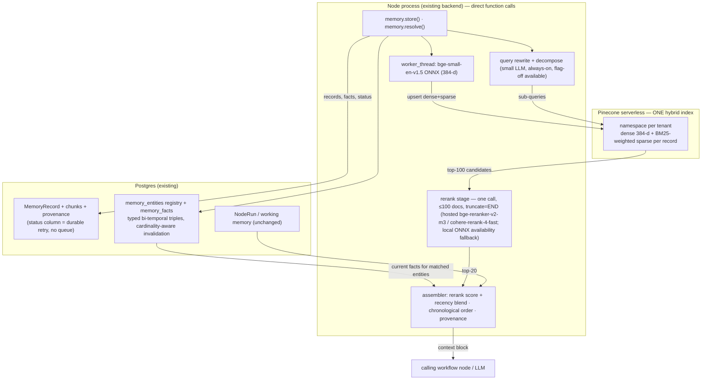

# Memory Engine v3 — First-Principles Redesign Report

**Verdict up front:** the right architecture at this scale is dramatically simpler than the v2.1 design. The current *implementation* (one Pinecone hybrid index + Postgres + local bge-small) is much closer to correct than the v2.1 *plan* was. This report removes the planned Client/SDK layer, Redis, the ingestion queue, Neo4j+Graphiti, LazyGraphRAG community summaries, and LLMLingua compression; keeps Pinecone, Postgres, and local bge-small-en-v1.5; and adds exactly three evidence-backed stages: a cross-encoder rerank, contextual chunk headers, and a bi-temporal fact table *in Postgres*. Everything is direct function calls inside the existing Node process.

Date: 2026-08-14 · Status: proposed (supersedes §3–§7 of [memory-engine-flow.md](memory-engine-flow.md) where they conflict) · Evidence: 16 agents across two research sweeps and a three-skeptic adversarial pass, plus local measurements on this machine, cited throughout. Claims the adversarial pass weakened or refuted have been corrected in place and are marked as such; §11 records the resulting confidence changes.

---

## 1. Scale reality check (the finding that reframes everything)

100M tokens at ~200-token chunks is **~500K chunks**. At 384 dimensions (bge-small-en-v1.5), that is **~0.77 GB of fp32 vectors**. This corpus fits in RAM on a laptop. Measured evidence:

| Measurement | Result | Source |
|---|---|---|
| **Exact** brute-force top-100 over 1M × 384 vectors (numpy, this machine) | **35 ms p50** (11 ms at 400K, 62 ms at 2M) | measured locally, 2026-08-14 |
| Same shape, independent (M4 MacBook, numpy) | 12 ms single-threaded, 1M × 384 | [softwaredoug.com](https://softwaredoug.com/blog/2026/07/29/just-brute-force-embeddings) |
| Single-node HNSW at ≥0.95 recall, 1M vectors | ~1–10 ms p95 | [Qdrant open benchmark](https://qdrant.tech/benchmarks/), [Weaviate ANN bench](https://docs.weaviate.io/weaviate/benchmarks/ann) |
| Query embedding, repo's actual ONNX path (bge-small, quantized) | **3.3 ms p50** | measured locally |
| Chunk embedding, repo's actual path | **28 ms/chunk, ~36 chunks/sec/thread** | measured locally |
| Faiss official guidance below 1M vectors | small IVF or HNSW; distributed sharding guidance starts at 100M–1B | [Faiss wiki](https://github.com/facebookresearch/faiss/wiki/Guidelines-to-choose-an-index) |

**Implication:** every stage of this pipeline is milliseconds except LLM calls and hosted reranking. The 10–20 s latency target is not a constraint to engineer toward — it is ~20–50× of headroom. The design question is not "how do we make it fast enough," it is "which accuracy stages earn their complexity." No credible source recommends a distributed vector cluster, a cache tier, or a queue broker at this scale.

Scope note: 100M tokens is treated as the *per-tenant worst case* (each tenant is one Pinecone namespace, queried in isolation). Aggregate corpus across tenants can be larger; that affects ingest cost and storage, not query latency, because namespaces are physically partitioned ([Pinecone docs](https://docs.pinecone.io/troubleshooting/namespaces-vs-metadata-filtering)).

---

## 2. Current architecture — layer-by-layer analysis

### 2.1 What actually runs today (`apps/backend`)

| Layer | Exact responsibility | Verdict |
|---|---|---|
| `smart-memory.ts` | Chunk + clean corpus, threshold gate (<400 chars = raw pass-through), dedupe (scopeKey+contentHash), store, resolve | **KEEP** — the raw/vector threshold is a correct "no retrieval below ~200K tokens" decision ([Anthropic's own guidance](https://www.anthropic.com/engineering/contextual-retrieval)) applied at micro scale |
| `pinecone-client.ts` | One serverless index, dotproduct, namespace per tenant | **KEEP** — namespace-per-tenant is Pinecone's official multi-tenancy pattern; physically partitioned |
| `sparse-encoder.ts` | FNV-1a hashed **TF-only** sparse vectors, alpha-blend 0.75 | **KEEP shape, FIX weighting** — it has no IDF, so common words score as high as discriminative ones; strictly weaker than BM25 (§5.2) |
| Local embeddings (`bge-small-en-v1.5`, 384-d ONNX) | Dense encoding, both paths | **KEEP** (mandated) — 3.3 ms/query measured; accuracy gap quantified and mitigated in §7 |
| Postgres `MemoryRecord` | Durable record of every memory + provenance + dedupe | **KEEP** |
| Timeline sampling | Chronologically even sample of records for temporal spread | **KEEP** — cheap SQL, directly serves temporal questions |
| `memory-compression.ts` / `context-builder.ts` / `memory-broker.ts` | Working memory: compact strings, node back-links, context bundles (Postgres `NodeRun`) | **KEEP** — this *is* the working-memory tier; plain SQL, no retrieval needed |
| Embedding on the main event loop | — | **FIX** — ONNX forward passes run on the request thread; a 32-chunk write blocks the event loop ~900 ms (measured). Move to `worker_threads` ([documented practitioner fix](https://www.sitepoint.com/optimizing-transformers-js-production/)) |

Two genuine defects, zero unnecessary layers. The running system is lean.

### 2.2 The v2.1 *planned* layers (designed, never built)

| Planned layer | Claimed value | First-principles verdict |
|---|---|---|
| Client layer (SDK / REST / MCP / framework adapters) | External integration surface | **REMOVE** (mandated). The engine is a TypeScript module in the same process. Direct function calls: `storeSmartMemory()`, `resolveSmartMemory()`. An HTTP/MCP surface can be added later without touching the engine — it is packaging, not architecture |
| Redis ingestion queue | Absorb write bursts | **REMOVE** (mandated + evidence). Measured write path: ~36 chunks/sec/thread embedding capacity vs a steady-state load of a few records per workflow run. Every queue study puts the "Postgres is trivially fine" line at ~100 jobs/sec and the "Redis becomes necessary" line at 1–5K jobs/sec sustained ([evidence table](https://github.com/hardbyte/postgresql-job-queue-benchmarking), [Solid Queue: 20M jobs/day on a DB queue](https://dev.37signals.com/introducing-solid-queue/)). We are 2–3 orders of magnitude below the threshold. Crash durability (the one real thing a queue buys here) comes from a `pending` status column on MemoryRecord + an in-process retry poller — zero new infrastructure |
| Redis retrieval cache | Latency/cost | **REMOVE**. Measured semantic-cache hit rates for personalized, per-tenant RAG: **15–25%** — the worst published category — with false-hit and staleness risks highest exactly here; guidance is skip below ~$200/mo projected savings ([production data](https://preto.ai/blog/semantic-caching-llm/)). Our retrieval costs milliseconds and pennies; there is nothing worth caching |
| Neo4j + Graphiti | Bi-temporal facts, contradiction handling, multi-hop | **REPLACE with a Postgres fact store** (§4.1) — with a crucial honesty note surfaced by adversarial review: Graphiti's accuracy comes from its *pipeline* (entity resolution + contradiction-based invalidation, both LLM stages), not from Neo4j. Those stages must be ported, not skipped — a bare `(entity, attribute)` key-close would corrupt multi-valued facts and miss alias/cross-predicate contradictions, so §4.1 specifies an entity registry and cardinality-aware invalidation. What the evidence supports removing is the graph *database*: on the actual access pattern (1–3 hop fan-out around matched entities), Postgres recursive CTEs measured **faster than Neo4j** (1-hop 0.4 ms vs 2.9 ms; 3-hop 43.7 ms vs 171.5 ms — [head-to-head at 134K facts](https://www.pedroalonso.net/blog/graphrag-vs-vector-postgres/); larger scales are extrapolation, measured at gate M0). Non-overlap is enforceable on this repo's Postgres 16 via `btree_gist` + `EXCLUDE` (raw SQL migration — not expressible in Prisma DSL; PG18 adds native `WITHOUT OVERLAPS`). Production precedent: Letta on Aurora Postgres; Zep v0 on Postgres+pgvector; **Mem0 v2.0 removed all external graph-DB backends** in Apr 2026 ([changelog](https://docs.mem0.ai/changelog/highlights)); Graphiti's lightest embedded backend (Kuzu) is deprecated. Neo4j wins only at variable-depth pathfinding (4–6+ hops, 85–135× faster) and whole-graph algorithms — workloads no BEAM/LongMemEval category requires |
| LazyGraphRAG community summaries | Global/thematic queries | **DEFER** — corrected justification (adversarial review caught the original as wrong: BEAM *does* have a Summarization category). The honest basis: retrieval-only systems score ≥89% on BEAM Summarization at every scale with no community detection (M-1: 92.8/89.5/91.9 — it sits in the "find explicit signals" top tier), so community machinery is not what that category needs. Gate M0 measures timeline-sampling adequacy on summarization queries; a cheap per-tenant rolling summary is the escalation if it falls short |
| LLMLingua compression | Token budget | **REMOVE** — top-20 chunks × ~200 tokens ≈ 4K tokens; the budget never binds. Truncation by rerank score is sufficient |
| Always-on query classifier LLM | Route every query | **SIMPLIFY to a single always-on rewrite+decompose call** (flag-off available). Adversarial review killed the heuristic-gate variant: the one published head-to-head puts handcrafted string rules near chance for routing while lightweight trained classifiers reach ~93% ([RAGRouter-Bench](https://arxiv.org/abs/2604.03455)), and OpenAI ships decomposition default-on in file_search. Always-on is also *less* code than a gate; a TF-IDF classifier gate is the documented cost optimization if per-query LLM spend ever matters |

---

## 3. Problems and bottlenecks in the current implementation

1. **No precision stage.** Retrieval quality stops at hybrid similarity. Every credible source puts a cross-encoder rerank as the single highest-ROI addition: +28–48% retrieval quality, and the final third of Anthropic's 67% failure-rate reduction ([evidence](https://www.anthropic.com/engineering/contextual-retrieval), [BEIR](https://arxiv.org/pdf/2212.06121), [AIMultiple: +20.3pp Hit@1](https://aimultiple.com/rerankers)).
2. **Sparse vectors have no IDF.** TF-only weighting means "appointment" and "the" (post-stopword survivors like "patient", "office") compete equally with rare discriminative terms. BM25-style weighting is the documented floor for hybrid quality (+2–5% OOD on top of dense, [BEIR 2026](https://app.ailog.fr/en/blog/news/beir-benchmark-update)).
3. **Chunks are embedded without context.** A chunk saying "she confirmed Tuesday works" embeds poorly. The strong evidence here is for **LLM-generated, chunk-specific situating context on document corpora**: −35–49% retrieval failures at ~$1/M tokens one-time ([Anthropic](https://www.anthropic.com/engineering/contextual-retrieval)). For memory records this report proposes deterministic metadata headers (date, source, scope, participants) — a *weaker-evidence* variant: Anthropic found chunk-agnostic prepended summaries gave "very limited gains," while metadata injection lifted financial-QA accuracy ~15–20 pts in a separate study ([arXiv 2510.24402](https://arxiv.org/pdf/2510.24402)). The M3 harness gate, not the Anthropic number, is the evidence for the record-header case.
4. **Similarity retrieval is temporally blind.** The BEAM paper's dominant failure mode analysis: systems answer with the *old* value of an updated fact even when both versions are retrieved ([arXiv 2510.27246](https://arxiv.org/abs/2510.27246)). Nothing in the current store can distinguish current from superseded facts. This is the biggest *accuracy* gap and the reason the claimed-SOTA M-1 still scores 45–55% on knowledge-update.
5. **Embedding blocks the event loop** (measured ~900 ms per 32-chunk write). Operational, not architectural — `worker_threads` fix.
6. **Dead-weight plans.** The v2.1 additions (Redis, Neo4j, MCP layer, compression) would have added five moving parts with no measured accuracy contribution at this scale. Removing them from the plan is the single biggest complexity win in this report.

---

## 4. Final architecture

Three stateful components. One process. No queue, no cache, no graph database, no service layer.

### 4.1 Write path (end-to-end data flow)

1. `memory.store(input, scope)` — direct call, no HTTP, no queue.
2. Clean, chunk, dedupe (unchanged). Row written to `MemoryRecord` with `status='pending'` **before** any processing — crash durability without a broker; an in-process poller retries stragglers.
3. **Deterministic contextual header** prepended to each chunk: date, source label, scope, participants (template, 0 LLM cost). Doc-derived chunks additionally get a one-line LLM situating summary (cheap model, prompt-cached, ~$1/M tokens).
4. Embed in a `worker_thread` (dense) + BM25-weighted sparse encode (IDF stats maintained in one Postgres table per namespace).
5. Upsert dense+sparse to the tenant namespace; mark record `stored`.
6. **Fact extraction and temporal maintenance** (a **new build** — the repo has no fact extraction today; adversarial review corrected an earlier draft that booked this as "existing, extended"). Three sub-steps, which are Graphiti's actual accuracy pipeline ported to Postgres:
   - **Entity resolution against a registry** — `memory_entities(id, tenant, canonical_name, aliases[], name_embedding)`. New mentions match via trigram + embedding similarity; ambiguous matches are adjudicated by the extraction LLM with episode context. Without this step, "Dr. Smith" / "John Smith" / "my dentist" become three entities and stale facts survive as "current" — the exact failure the fact store exists to kill.
   - **Typed triples, resolved endpoints** — `memory_facts(subject_entity_id, predicate, object_entity_id NULLABLE, object_value, valid_from, valid_to, event_time, confidence, source_record_id)`, so reverse lookups ("who works at X?") and 2-hop joins run on IDs, not strings.
   - **Cardinality-aware invalidation** — predicates declare single- vs multi-valued. Single-valued (`phone`, `lives_in`): new fact closes the old row's `valid_to`; non-overlap enforced via `btree_gist` `EXCLUDE` constraint (raw SQL migration — this repo's PG16 has no `WITHOUT OVERLAPS`, and this repo applies migrations via `migrate diff`+`resolve`). Multi-valued (`allergy`, `preference`, `child`): facts accumulate — key-close here would *destroy true facts* (BEAM's Preference Following category tests exactly this). Cross-predicate contradictions ("moved to Berlin" vs `lives_in: London`) get a subject-scoped LLM contradiction check against semantically related current facts — Graphiti's mechanism, cheap because it is scoped to one entity's current rows.

### 4.2 Read path

1. `memory.resolve(query, scope, k)` — direct call.
2. Raw mode short-circuit (unchanged): sub-threshold corpora are passed through whole. This is the correct no-retrieval regime.
3. **Always-on rewrite + decompose** (one small-LLM call, ~0.5–1 s, flag-off available): query rewriting, parallel sub-queries for multi-part questions, time-range extraction ([evidence: +5–15 pts recall on hard queries](https://arxiv.org/pdf/2408.04259); [OpenAI ships this default-on](https://developers.openai.com/api/docs/guides/retrieval)). Adversarial review removed the earlier heuristic-gate variant — string-rule gating has no published support (near chance in the one head-to-head, [RAGRouter-Bench](https://arxiv.org/abs/2604.03455)).
4. Hybrid query (dense + sparse, alpha-blended, one Pinecone call per sub-query in parallel, time-range metadata filter when extracted) → candidates merged and **deduped to ≤100 by first-stage score** before reranking.
5. `memory_facts` lookup for entities named in the query: **current facts only** (`valid_to IS NULL`) by default — the model never arbitrates between stale and current versions, which eliminates the BEAM answered-with-the-old-value failure at the data layer. "What changed / as of X" queries flip to interval queries; contradiction checks deliberately fetch both sides.
6. Rerank the ≤100 merged candidates → top-20 in **one hosted call** (~250–600 ms measured band; the sweet spot per evidence is 50–100 in, ~20 out ([Anthropic recipe](https://www.anthropic.com/engineering/contextual-retrieval), [cascade guidance](https://zeroentropy.dev/articles/ultimate-guide-to-choosing-the-best-reranking-model-in-2025/)) — reranking 300 raw candidates was never evidence-backed and would exceed the hosted 100-doc/call cap). Operational constraints verified against [Pinecone's docs](https://docs.pinecone.io/guides/search/rerank-results): hosted `bge-reranker-v2-m3` = 100 docs/call, **60 req/min project-wide on every tier**, 500 calls/month on Starter; set `truncate=END` explicitly (default `NONE` errors the whole call on one oversized chunk). Past ~1 rerank-QPS platform-wide, escalate to `cohere-rerank-4-fast` (250 docs, 300 req/min, Standard tier, $0.002/query) or a local GPU reranker.
7. Assemble: rerank score blended with recency decay, chronological ordering (retrieval order destroys temporal order — BEAM failure mode), provenance lines, timeline sample appended for temporal spread.

---

## 5. Latency analysis (per stage, measured where possible)

| Stage | p50 | p95 / cold | Evidence class |
|---|---|---|---|
| Query embed (bge-small ONNX, local) | **3.3 ms** | 5 ms | measured, this (M-series) machine |
| Rewrite/decompose call (Flash-class, always-on, flag-off available) | 0.5–1 s | ~2 s | Artificial Analysis + independent ([source](https://artificialanalysis.ai/models/gemini-2-5-flash/providers)) |
| Pinecone hybrid query (warm ns, client-observed; sub-queries parallel, same ns → one cold penalty not N) | 30–100 ms | 300–400 ms cold first hit — *beta-era evidence from a tiny namespace; unvalidated at 500K chunks, may grow with namespace size* | community-measured + vendor ([source](https://community.pinecone.io/t/expected-query-latency-on-serverless/4423)) |
| `memory_facts` SQL (indexed, ≤3 hop fan-out) | 0.4–5 ms | ~44 ms (3-hop — **at 134K facts**; larger scales unmeasured, gated at M0) | independent benchmark ([source](https://www.pedroalonso.net/blog/graphrag-vs-vector-postgres/)) |
| Rerank ≤100 docs, **one** hosted call (`truncate=END`) | 250–450 ms | ~600 ms | independent leaderboard ([Agentset](https://agentset.ai/rerankers), [ZeroEntropy](https://zeroentropy.dev/articles/lightning-fast-reranking-with-zerank-1/)) |
| Rerank 50 pairs, local CPU fallback | 350–450 ms on laptop-class CPU; **seconds on a 2 vCPU VM** — an availability fallback, not a latency one | ~800 ms+ | independent ([markaicode](https://markaicode.com/bge-reranker-cross-encoder-reranking-rag/)) |
| Assembly (pure JS) | <5 ms | <10 ms | trivial |
| **Total, decompose flag off** | **~0.3–0.6 s** | **~1.5 s** (cold) | derived |
| **Total, default path (rewrite+decompose on)** | **~0.9–1.7 s** | **~3–3.5 s** (cold namespace + slow LLM call; stage p95s don't strictly add, so true p95 sits below the 3.5 s straight sum) | derived |

Against the 10–20 s target: **~3–6× headroom on the honest worst path, ~10× typical**. The bottleneck stages are the two external API calls (LLM rewrite, hosted rerank) — both swappable, neither load-bearing for correctness. A throughput note the first draft missed (adversarial review): hosted `bge-reranker-v2-m3` is capped at **60 requests/min project-wide on every Pinecone tier** — a platform ceiling of ~1 rerank-QPS. Fine for current traffic; the documented escalation is cohere-rerank-4-fast (300 req/min) or local GPU.

Ingest (corrected for deploy hardware): the measured 36 chunks/sec/thread is M-series laptop silicon. On a 2 vCPU cloud VM, independent benchmarks put small-model CPU embedding at roughly an order of magnitude less (~5–15 chunks/sec total, [cloud-VM embedding benchmark](https://nullmirror.com/en/blog/2026-02-28-embedding-models-on-affordable-cloud-vms-and-apple-silicon/)) — a 500K-chunk backfill is **~9–28 h there, not ~4 h**, worker threads only scale to core count, burstable instances throttle further, and a backfill contends with the serving path on the same box. One-time cost either way; schedule off-peak or run the backfill from a beefier temporary machine.

Removed stages save: Redis round-trips (0 — never built), queue hop (~5–2000 ms depending on poll), Neo4j round-trip (~2–170 ms + JVM ops), MCP/HTTP layer (~1–10 ms + serialization). The redesign is faster than v2.1 *by subtraction*.

---

## 6. Cost comparison (monthly, steady state)

| Component | v2.1 planned | v3 proposed |
|---|---|---|
| Pinecone (1M × 384 + sparse ≈ 1.6 GB) | same | **~$0–5** — inside the free Starter tier (2 GB, 1M RU, 2M WU) until multi-tenant growth; low tens of $ after |
| Redis (managed) | ~$15+ | **$0** — removed |
| Neo4j (managed AuraDB / self-host RAM) | ~$65+ or ~2 GB+ JVM | **$0** — removed |
| Rerank | Voyage/Cohere API | Free-tier `bge-reranker-v2-m3` is **dev-only** (500 calls/month on Starter — adversarial review caught the earlier "$0 in production" claim); production = Pinecone Standard (60 req/min ceiling) or cohere-rerank-4-fast at **$0.002/query** (~$2/1K retrievals) |
| Query rewrite/decompose (always-on, Flash-class) | — | ~$0.0001–0.001/query; flag-off available |
| Embedding | $0 (local, mandated) | $0 (local, mandated) |
| Contextual headers | LLM per chunk | **$0 for memory records** (deterministic); ~$1/M tokens one-time for uploaded docs |
| Fact extraction + entity resolution + contradiction checks | (planned via Graphiti LLM calls) | the same class of LLM calls Graphiti makes, written to Postgres — no graph-DB tax, but **not $0**: resolution/adjudication calls are booked per ingested episode (cheap-model, subject-scoped) |
| Queue/workers infra | Redis + worker fleet | **$0** — in-process |

Net: v3 removes every fixed infra cost except Pinecone (which currently rounds to zero at this scale) and cuts the planned stack from 6 stateful services to 2 (Pinecone + existing Postgres).

---

## 7. Accuracy trade-offs — honest accounting

**What bge-small-en-v1.5 costs us (mandated, quantified):** MTEB-v1 BEIR-15 retrieval nDCG@10 = **51.68** vs bge-large 54.29, OpenAI-3-large 55.44, gte-large 57.91 — a 3–6 point first-stage gap vs practical alternatives ([model card](https://huggingface.co/BAAI/bge-small-en-v1.5), same-scale comparisons).

**Why the pipeline should narrow it substantially (with the evidence graded honestly after adversarial review):**
- Hybrid BM25+dense gives a lexical floor independent of embedder quality (+15–30% vs pure vector; bi-encoders show *no* out-of-domain gain over BM25, so the sparse leg does the OOD work — [arXiv 2212.06121](https://arxiv.org/pdf/2212.06121)).
- Cross-encoder rerank flattens first-stage differences when recall@100 holds: BM25+CE beat every dense bi-encoder of its era on BEIR ([Thakur et al.](https://www.emergentmind.com/topics/beir-benchmark)); rerankers add +20pp Hit@1 from a modest first stage ([AIMultiple](https://aimultiple.com/rerankers)). A *suggestive* (not direct) 2025 result: a MiniLM-class embedder beat BGE-Large end-to-end — but inside a **tri-modal (dense+sparse+graph-entity) system with GPT-4o agentic reranking, on three small BEIR corpora, with no ablation isolating our dense+sparse+CE configuration** ([arXiv 2506.00049](https://arxiv.org/html/2506.00049)). Directional support only.
- **bge-small's recall@100 is published, and the gap is real** (a correction from adversarial review — the first draft wrongly called it unpublished). From MTEB model-card metadata, bge-small vs bge-large recall@100: MSMARCO 87.6 vs 89.0, NQ 91.9 vs 94.4, HotpotQA 84.9 vs 89.2, CQADupstack (closest to conversational) 73.6 vs 76.4, **FiQA 69.6 vs 77.0**, **ClimateFEVER 60.5 vs 68.6** — i.e., on the harder tasks, 15–30% of gold documents never enter bge-small's top-100, and no reranker can recover them. On conversational-memory data specifically, even a 1.5B retriever reached only ~0.78 recall@10 in the LongMemEval paper — this data regime is hard for everyone, and no published number exists for bge-small on it.
- The compensating levers unique to our scale: first-stage k can be raised far past 100 almost for free (namespace-scoped search over ≤1M vectors costs tens of ms — recall@k rises monotonically with k), the sparse leg and decomposition sub-queries each add independent recall paths, and the deduped merge feeds the reranker its ≤100 best.
- Contextual indexing attacks the same failure class from the write side — with the evidence split stated in §3.3: strong for LLM-situated document chunks, unproven-but-gated for deterministic record headers.

**Where the accuracy gains are expected (mechanism + gate, not promise):** rerank (+28–48% class evidence), contextual indexing (measured at M3), BM25-IDF sparse fix (+2–5% OOD class), temporal fact store (targets the two categories where the claimed SOTA collapses: knowledge-update 45–55% and multi-session at scale — validity-filtered reads remove the stale-fact failure at the data layer *provided entity resolution holds*, which M5's alias-drift test set verifies).

**On the "≈99% of M-1's BEAM average" success criterion:** no honest engineer can promise a benchmark score ex ante — and M-1's own numbers are unverified vendor self-reports judged by their own answering model (see [memory-engine-flow.md §9.3](memory-engine-flow.md)). What this design commits to instead: run LongMemEval + BEAM-100K/1M on a fixed harness with disclosed judge, top-k curve, and run count (gate M0/M5); track knowledge-update and multi-session as the two KPIs; the architecture specifically targets the failure modes that cap current systems. Chasing a number against a moving, self-reported target is not engineering.

---

## 8. Scalability analysis

- **Query side:** namespace isolation means per-tenant query cost is flat in tenant count. At 10× the target (1B tokens / ~5M chunks per tenant) Pinecone serverless is still comfortably in range (its own case studies run 135M vectors); local exact search stops being an option past ~5M chunks — the managed index earns its place precisely there.
- **Ingest side:** scales linearly with aggregate tokens across tenants; worker threads scale to core count; past ~50–100 chunks/sec sustained (≈ 3–5 orders above today), promote the status-column poller to pg-boss (same Postgres, library not service). Redis enters the conversation only at 1–5K jobs/sec sustained — documented threshold, nowhere in sight.
- **Fact table:** the measured CTE numbers are from a 134K-fact benchmark; behavior at 1–10M facts is extrapolation until M0 measures it (fixed-depth joins scale flat with table size, but cost is proportional to *reachable set* — the hub-entity risk). Growth risks are hub entities (predicate-filtered reads, per-hop LIMIT, relevance pruning; fan-out measured at M0) and churn bloat (autovacuum tuning; volumes here are far below the documented danger zone of ~1K+ writes/sec).
- **Postgres 100-connection ceilings, WAL churn, etc.:** write volumes are memory-record-scale (per workflow run), not event-stream scale; no evidence of approach to any documented limit.

## 9. Failure modes and risks

| Risk | Severity | Mitigation |
|---|---|---|
| bge-small recall@100 insufficient on our data | High (caps everything) | Known BEIR numbers already sit below 0.9 on the harder tasks (§7) — so M0 measures on *our* data, and the levers are: raise first-stage k well past 100 (tens of ms at this scale), sparse leg, decomposition sub-queries, contextual indexing. Model swap is off the table (mandated) |
| Entity-resolution errors corrupt the fact store (wrong merge → wrong invalidation; missed merge → stale "current" facts) | **High for the fact layer's value** | Conservative merge threshold (unmerged beats wrongly merged — a missed alias degrades to baseline behavior, a wrong merge invalidates true facts); LLM adjudication only above similarity floor; M5 alias-drift/multi-valued/cross-predicate test set is the gate |
| Cold-namespace latency tails (per-tenant namespaces are mostly cold) | Low (300–400 ms known; unvalidated at 500K-chunk namespaces) | Accept; optional warm-up ping for latency-sensitive tenants; validate penalty at scale during M0 |
| Hosted rerank rate ceiling (60 req/min project-wide, every tier, bge-v2-m3) | Medium at platform scale | ~1 rerank-QPS platform ceiling; escalation path pre-decided: cohere-rerank-4-fast (300 req/min, Standard) → local GPU reranker |
| Fact-extraction LLM errors poison `memory_facts` | Medium | Confidence threshold on write; provenance pointer on every fact; facts *augment* retrieval, never replace it; wrong fact is correctable by re-extraction (rows are versioned, nothing destroyed) |
| Hosted reranker outage/deprecation (cohere-3.5 → 4-fast precedent) | Low | Stage is swappable; local bge-reranker-v2-m3 ONNX fallback preserves **availability** (laptop-class ~400 ms; seconds on a 2 vCPU VM — not a latency fallback); scores recalibrated per model, never stored raw |
| Hub-entity fan-out in `memory_facts` (the user node touches most facts in a tenant) | Medium | Reads are predicate-filtered indexed lookups, not open traversals; per-hop LIMIT + relevance pruning; M0 measures fan-out on user-centered queries before the 10M-fact claim is relied on |
| Event-loop stalls under concurrent writes | Medium today | worker_threads (M1); measured single-thread capacity already 36 chunks/sec |
| Sparse-score domination in single-index hybrid (unnormalized) | Low | Existing alpha-weighting already bounds it; IDF fix makes sparse scores better-behaved |
| Postgres queue-table bloat | Very low at this volume | Status column churns one row per record; documented failure zone starts ~1K writes/sec |
| LISTEN/NOTIFY global-lock trap | N/A | Not used — plain polling suffices at this volume |

## 10. Migration plan (each phase independently shippable + reversible)

| Phase | Change | Gate to proceed |
|---|---|---|
| **M0** | Build eval harness: LongMemEval subset + BEAM-100K sample + ~50 in-domain memory queries; measure baseline **recall@100/recall@200**, summarization-category adequacy of timeline sampling, and hub-entity fan-out on user-centered fact queries | Baseline numbers recorded; the three open empirical questions answered |
| **M1** | worker_threads embedding + `status` column durability + delete Redis/queue/MCP/Neo4j/compression from the v2.1 plan (no code exists — plan edit only) | Typecheck + existing tests green |
| **M2** | Rerank stage behind a flag: merge/dedupe to ≤100 → one hosted call (`truncate=END`); dev on free-tier bge-v2-m3, production config = Standard tier or cohere-rerank-4-fast | Harness: nDCG/Hit@k improves; p95 < 2 s holds (decompose off) |
| **M3** | Deterministic contextual headers on new chunks (+ LLM situating lines for doc-derived chunks); backfill lazily on access | Harness: retrieval-failure rate drops — **this gate is the evidence for template headers, which have none in the literature**; no regression |
| **M4** | BM25-IDF sparse weighting (DF stats table, cached in-process; re-upsert corpus in background) | Harness: OOD/keyword queries improve |
| **M5** | Fact layer (**new build**): `memory_entities` registry + resolution step, typed-triple `memory_facts` (raw-SQL `btree_gist` EXCLUDE migration via this repo's `migrate diff`+`resolve` flow), cardinality-aware invalidation + subject-scoped contradiction check, current-facts read merge | Harness: knowledge-update KPI moves; **alias-drift set** (3 surface forms + 1 update → exactly one current row), **multi-valued set** (second allergy → both current), **cross-predicate set** (moved_to vs lives_in → invalidation) all pass |
| **M6** | Always-on query rewrite+decompose (flag-off available); optional later: TF-IDF-classifier gate if per-query LLM cost matters | Harness: multi-session KPI moves; p95 within §5 bands |

Rollback: every phase is a flag or an additive table; M4 keeps old sparse vectors until re-upsert completes; nothing destructive at any step.

## 11. Confidence ledger

Every recommendation below was attacked by three independent adversarial reviewers (graph/fact-store lens, latency/throughput lens, accuracy-evidence lens) before these numbers were set. Nothing was refuted at the architecture level; the material corrections were: the fact-store schema needed Graphiti's resolution/invalidation pipeline (not just its table shape), the "<3 s p95 at 95%" claim didn't survive honest tail math, the free-tier rerank cost claim was dev-only, deploy-hardware ingest is ~an order slower than the laptop measurement, and three accuracy citations were graded down from "direct" to "directional." Full verdicts are preserved in the session's research archive.

| Recommendation | Confidence | Basis |
|---|---|---|
| Remove client/SDK/MCP layer → direct calls | **100%** | Mandated; packaging not architecture |
| Remove Redis (queue + cache) | **98%** | Mandated + not in current code + 2–3 orders below every documented necessity threshold + measured cache hit rates for this workload |
| No queue at all (status column + poller) | **95%** | Measured write rates; documented practitioner pattern; pg-boss as the pre-planned escalation |
| Keep Pinecone as vector store | **90%** | Standing decision + running code + zero ops + free tier at this scale. *Evidence note:* at ≤2M vectors, pgvector/in-process would be cheaper and lower-latency (measured 12–35 ms exact search; $0 marginal — and the prod image `pgvector/pgvector:pg16-trixie` already ships pgvector); flipping is justified only if the Pinecone directive is reversed — not proposed here |
| Keep single hybrid index (vs v2.1's two-index cascade) | **88%** | Current code works; one write, one query; two-index gains unproven at this scale — revisit only if M4 sparse quality disappoints |
| bge-small + hybrid + rerank *narrows* the larger-embedder gap enough | **65%** (→ measured at M0) | Revised down after adversarial review: the headline paper is tri-modal + GPT-4o-reranked on small corpora (directional only), and published recall@100 shows bge-small losing 1.4–8.1 pts to bge-large per task. The levers (raise k, sparse leg, decomposition, headers) are real but their sufficiency on conversational data is exactly what M0 measures |
| Add cross-encoder rerank (one call, ≤100 docs, `truncate=END`) | **95%** | Strongest single-stage evidence in the literature; operational caps documented |
| LLM situating context for doc-derived chunks | **90%** | Anthropic's measured −35–49% failure reduction is for exactly this |
| Deterministic headers for memory records | **70%** (→ measured at M3) | Revised down: Anthropic found chunk-agnostic prepends weak; metadata-injection support is from a different domain; M3's gate is the evidence |
| Fix sparse weighting to BM25-IDF | **90%** | Current TF-only encoder is strictly weaker; BM25 floor evidence |
| Postgres as the fact-store substrate (no Neo4j) | **90%** | CTE benchmarks on the access pattern + PG16 GiST exclusion + Letta/Zep-v0/Mem0-v2 precedent; no benchmark category needs >3 hops or graph algorithms |
| The §4.1 fact *pipeline* (entity registry + cardinality-aware invalidation) delivers Graphiti-grade temporal accuracy | **75%** (→ M5 test set) | Redesigned after adversarial review refuted the original key-close schema; the mechanism now matches Graphiti's, but it is a new build whose extraction/resolution quality is unproven until M5's alias-drift/multi-valued/cross-predicate gates pass |
| Defer LazyGraphRAG / compression / community summaries | **85%** | Corrected basis: BEAM's Summarization category is served ≥89% by retrieval-only systems; M0 measures our own adequacy; rolling-summary escalation pre-defined |
| Always-on rewrite+decompose (heuristic gate dropped) | **85%** | Decomposition value is well-evidenced and production-standard (OpenAI default-on); the dropped gate had near-chance published support |
| End-to-end retrieval p95 < 4 s; < 10–20 s target | **95%** | Honest tail sum ~3–3.5 s (cold + decompose); < 3 s holds at ~90% with decompose off or warm namespaces — the first draft's blanket "<3 s at 95%" was corrected by adversarial review |

---

## Sources

Local measurements (this machine, 2026-08-14): brute-force numpy benchmark; bge-small ONNX embed timings via the repo's own `@xenova/transformers` path.
Vector search at scale: [softwaredoug brute-force](https://softwaredoug.com/blog/2026/07/29/just-brute-force-embeddings) · [Qdrant benchmarks](https://qdrant.tech/benchmarks/) · [Weaviate ANN benchmarks](https://docs.weaviate.io/weaviate/benchmarks/ann) · [Faiss index guidelines](https://github.com/facebookresearch/faiss/wiki/Guidelines-to-choose-an-index) · [Pinecone serverless latency thread](https://community.pinecone.io/t/expected-query-latency-on-serverless/4423) · [namespaces vs metadata](https://docs.pinecone.io/troubleshooting/namespaces-vs-metadata-filtering)
Embeddings & reranking: [bge-small-en-v1.5 card](https://huggingface.co/BAAI/bge-small-en-v1.5) · [Anthropic contextual retrieval](https://www.anthropic.com/engineering/contextual-retrieval) · [In Defense of Cross-Encoders](https://arxiv.org/pdf/2212.06121) · [Rethinking Hybrid Retrieval](https://arxiv.org/pdf/2506.00049) · [AIMultiple reranker benchmark](https://aimultiple.com/rerankers) · [Agentset reranker leaderboard](https://agentset.ai/rerankers) · [ZeroEntropy latency](https://zeroentropy.dev/articles/lightning-fast-reranking-with-zerank-1/) · [BGE reranker CPU timing](https://markaicode.com/bge-reranker-cross-encoder-reranking-rag/) · [BEIR 2026 aggregate](https://app.ailog.fr/en/blog/news/beir-benchmark-update)
Production RAG: [Perplexity on Vespa](https://blog.vespa.ai/perplexity-show-what-great-rag-takes/) · [OpenAI file_search](https://developers.openai.com/api/docs/guides/retrieval) · [Claude Code deleted RAG](https://vadim.blog/claude-code-no-indexing/) · [EfficientRAG decomposition](https://arxiv.org/pdf/2408.04259) · [rerank cascade guide](https://zeroentropy.dev/articles/ultimate-guide-to-choosing-the-best-reranking-model-in-2025/)
Postgres vs graph/queue/cache: [PG vs Neo4j head-to-head](https://www.pedroalonso.net/blog/graphrag-vs-vector-postgres/) · [PG19 graph queries](https://exobench.ai/blog/pg19-graph-queries-part-1) · [PG18 temporal constraints](https://neon.com/postgresql/postgresql-18/temporal-constraints) · [Mem0 v2 changelog](https://docs.mem0.ai/changelog/highlights) · [Letta on Aurora](https://aws.amazon.com/blogs/database/how-letta-builds-production-ready-ai-agents-with-amazon-aurora-postgresql/) · [PG queue benchmarking](https://github.com/hardbyte/postgresql-job-queue-benchmarking) · [Solid Queue](https://dev.37signals.com/introducing-solid-queue/) · [I removed Redis](https://dev.to/aws-builders/i-removed-redis-from-my-stack-and-used-postgresql-for-job-queues-instead-2lp5) · [Recall.ai LISTEN/NOTIFY postmortem](https://www.recall.ai/blog/postgres-listen-notify-does-not-scale) · [semantic-cache hit rates](https://preto.ai/blog/semantic-caching-llm/) · [transformers.js in production](https://www.sitepoint.com/optimizing-transformers-js-production/)
Memory benchmarks: [BEAM paper](https://arxiv.org/abs/2510.27246) · [LongMemEval](https://arxiv.org/abs/2410.10813) · Exabase/M-1 analysis in [memory-engine-flow.md §9](memory-engine-flow.md)
