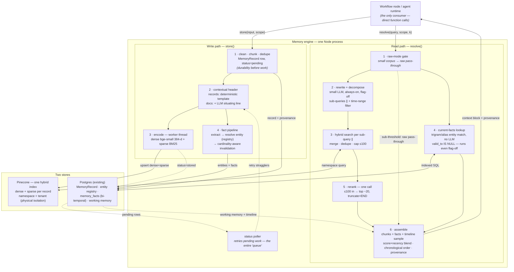

# Memory Engine v3 — Final Architecture

The simplest architecture that achieves the required functionality: **one Node process, one Pinecone hybrid index, one Postgres database.** Everything else identified in the review — Redis, a queue broker, Neo4j/Graphiti, a client/SDK layer, a cache tier, context compression, community summaries — is deliberately absent, each with a stated reason and a re-entry trigger.

Date: 2026-08-14 · Status: final draft · Analysis and evidence: [memory-engine-redesign.md](memory-engine-redesign.md) (full research citations, adversarial-review verdicts, confidence ledger) · Locked decisions: embedding model stays `bge-small-en-v1.5` (revisit later with M0 harness data); Pinecone stays the vector store; no Redis; direct function calls only.

---

## 1. Issue register — every identified issue, root cause → solution → impact → implementation

Context for cold readers: **BEAM** is the ICLR-2026 long-term-memory benchmark (100K–10M-token conversations); **M-1** is Exabase's commercial memory engine, holder of the highest (self-reported) BEAM scores; **Graphiti** is Zep's open-source temporal-knowledge-graph memory library; **v2.1** is the previous plan ([memory-engine-flow.md](memory-engine-flow.md)). Phases **M0–M6** are the migration order sequenced in §4.

### I1 — No precision stage after first-stage retrieval

- **Root cause:** the pipeline was built as minimal hybrid similarity search; nothing re-scores candidates against the query, so final quality is capped by bi-encoder similarity — the weakest signal in the modern stack.
- **Solution:** one cross-encoder rerank call per query: merge/dedupe first-stage candidates to ≤100, rerank, keep top ~20.
- **Impact:** the single highest-ROI accuracy stage in the literature (+28–48% retrieval-quality class; the final third of Anthropic's 67% failure-rate reduction). Trade-offs: +250–600 ms per query; hosted `bge-reranker-v2-m3` is rate-capped (60 req/min project-wide, 500 calls/month free tier → dev only); escalation is cohere-rerank-4-fast ($0.002/query) or a local GPU reranker.
- **Implementation:** Pinecone `/rerank` with `truncate=END` set explicitly (default `NONE` fails the whole call on one oversized chunk). Behind a flag. Dependencies: none. Phase M2.

### I2 — Sparse leg has no IDF

- **Root cause:** the homegrown sparse encoder (FNV-1a hash + sublinear TF) was built dependency-free, but term-frequency-only weighting means common surviving words score like rare discriminative ones — strictly weaker than BM25.
- **Solution:** BM25 weighting: per-namespace document-frequency statistics in one Postgres table, cached in-process; same hashed sparse-vector format, better values.
- **Impact:** +2–5% on out-of-domain/keyword queries (the class where the small dense embedder is weakest — the sparse leg is its safety net). Trade-offs: DF stats must update as the corpus grows (approximate is fine — BM25 is robust to slightly stale DF); existing vectors need a background re-upsert.
- **Implementation:** extend `sparse-encoder.ts`; re-upsert lazily or in a background sweep. Dependencies: none. Phase M4.

### I3 — Chunks are embedded without context

- **Root cause:** chunks are embedded as raw text; "she confirmed Tuesday works" carries no scope, date, or subject for the embedder or reranker to match on.
- **Solution:** prepend a header at write time. Memory records get a **deterministic template** (date, source, scope, participants — zero LLM cost). Document-derived chunks get an **LLM situating line** (the variant Anthropic measured at −35–49% retrieval failures, ~$1/M tokens one-time with prompt caching).
- **Impact:** attacks retrieval failures from the indexing side; helps dense, sparse, and rerank stages simultaneously. Trade-offs stated honestly: the evidence is strong for the LLM-situated document case, *weaker for deterministic templates* (Anthropic found chunk-agnostic prepends gave limited gains; metadata-injection support comes from a different domain) — the M3 harness gate is the evidence for the template case, not the citation.
- **Implementation:** write-path only; headers included in text for both index legs. Backfill lazily on access. Dependencies: eval harness (M0) to gate it. Phase M3.

### I4 — Temporal blindness: stale facts compete as equals

- **Root cause:** two compounding gaps. (a) Similarity retrieval has no concept of validity — the BEAM paper's dominant failure mode is answering with the *old* value of an updated fact even when both versions were retrieved. (b) The store has no fact model at all, so nothing *can* distinguish current from superseded. This is why even the claimed-SOTA M-1 scores 45–55% on knowledge-update.
- **Solution:** a fact layer in Postgres implementing Graphiti's *pipeline* without its database:
  1. `memory_entities` registry (canonical name, aliases, name embedding) with write-time resolution — trigram + embedding candidate match, LLM adjudication only above a similarity floor. Without this, "Dr. Smith"/"John Smith"/"my dentist" fragment into three entities and stale facts survive as current.
  2. `memory_facts` as typed bi-temporal triples: `(subject_entity_id, predicate, object_entity_id | object_value, valid_from, valid_to, event_time, confidence, source_record_id)`.
  3. **Cardinality-aware invalidation:** single-valued predicates (`phone`, `lives_in`) close the old row on update, enforced by a `btree_gist` EXCLUDE constraint; multi-valued predicates (`allergy`, `preference`) accumulate — key-closing them would destroy true facts; cross-predicate contradictions get a subject-scoped LLM check against semantically related current facts.
  4. Reads default to **current facts only** (`valid_to IS NULL`) — version arbitration happens at the data layer, never by similarity ranking. "What changed / as of X" queries flip to interval mode; contradiction checks deliberately fetch both sides.
- **Impact:** targets exactly the two benchmark categories where every current system collapses (knowledge-update, multi-session at scale). Trade-offs: this is the largest remaining complexity item — a new extraction/resolution build whose quality is the gating risk (wrong entity merge invalidates true facts; conservative thresholds make missed-merge the failure mode, which degrades to baseline rather than corrupting). Adds per-episode LLM cost (cheap model, subject-scoped calls).
- **Implementation:** raw-SQL migration for the EXCLUDE constraint (not expressible in Prisma DSL; use this repo's `migrate diff`+`resolve` flow; prod Postgres is 16 — `WITHOUT OVERLAPS` needs 18). Facts *augment* chunk retrieval, never replace it. Dependencies: extraction LLM, M5 test sets (alias-drift, multi-valued, cross-predicate). Phase M5 — last accuracy phase, after cheaper wins land.

### I5 — Embedding blocks the event loop

- **Root cause:** ONNX forward passes run on the request thread; a 32-chunk write blocks the process ~900 ms (measured).
- **Solution:** run the embedding pipeline in a `worker_thread`, loaded once, message-passed.
- **Impact:** removes serving-path stalls during writes; no trade-off. Note for capacity planning: measured 36 chunks/sec/thread is M-series silicon; a 2 vCPU cloud VM does ~5–15 chunks/sec total, so a 500K-chunk backfill is ~9–28 h there — run one-time backfills off-peak or from a bigger temporary machine.
- **Implementation:** worker wrapper around the existing pipeline. Dependencies: none. Phase M1.

### I6 — Writes have no crash durability

- **Root cause:** fire-and-forget async: a deploy, crash, or OOM between accepting a memory and finishing embedding/upsert silently loses it.
- **Solution:** write the `MemoryRecord` row with `status='pending'` *before* processing; an in-process poller retries stragglers to completion (at-least-once).
- **Impact:** durability with zero new infrastructure. This is the entire legitimate function a queue broker would have served at this write volume (measured load is orders of magnitude below every documented "you need Redis" threshold). Trade-off: none at this volume; the pre-decided escalation at ~50–100 sustained chunks/sec is pg-boss — a library on the same Postgres, still not a service.
- **Implementation:** one column + one poller. Dependencies: none. Phase M1.

### I7 — Single-query retrieval under-serves multi-part and temporal questions

- **Root cause:** one query embedding cannot represent several distinct information needs ("what did she order last time and is she allergic to anything?"), and temporal constraints ("last March") are invisible to similarity.
- **Solution:** one always-on small-LLM call that rewrites the query, decomposes multi-part questions into parallel sub-queries, and extracts time ranges (applied as metadata filters). Flag-off available per deployment.
- **Impact:** +5–15 pts recall on hard queries; production-standard (OpenAI file_search ships it default-on). Trade-offs: +0.5–1 s p50 and ~$0.0001–0.001 per query on *every* query; accepted against a 10–20 s budget. A heuristic string-rule gate was considered and **rejected** — near-chance published support; a TF-IDF classifier gate is the documented cost optimization if per-query spend ever matters.
- **Implementation:** one structured-output call; sub-queries fan out in parallel; results merge/dedupe to ≤100 before rerank (bounded rerank cost regardless of sub-query count). Dependencies: LLM provider. Phase M6.

### I8 — First-stage recall ceiling from the small embedder

- **Root cause:** `bge-small-en-v1.5` (33M params, 384-d) trails larger embedders by 1.4–8.1 points recall@100 per BEIR task (worst: ClimateFEVER −8.1, FiQA −7.4); candidates missing from the top-k are unrecoverable by any downstream stage.
- **Solution (model locked by decision — compensate, measure, defer the swap):** raise first-stage k well beyond 100 (namespace-scoped search over ≤1M vectors costs tens of ms — k is nearly free at this scale); lean on the sparse leg (its OOD floor is independent of embedder size); decomposition sub-queries add independent recall paths; headers improve embeddability. **M0 measures recall@100/@200 on our data** — producing exactly the evidence needed for the later model evaluation the team has planned.
- **Impact:** partial mitigation with quantified residual risk. Trade-off: accepted knowingly; the harness data converts "should we swap models later" from opinion into a measured decision.
- **Implementation:** k is a config value; no code dependency. Phase M0 (measurement) + M3/M4/M6 (the compensating stages — rerank M2 improves precision but cannot recover candidates recall already missed).

### I9 — Planned complexity with no accuracy contribution (v2.1 debt)

- **Root cause:** the v2.1 design was assembled from vendor architecture patterns built for 100–1000× this scale — tiered vector stores, queue brokers, graph databases, protocol layers — rather than from measured load and corpus size (100M tokens ≈ ~500K chunks ≈ 0.77 GB of vectors; exact search takes ≤35 ms — measured at 1M vectors, ~11 ms at 400K).
- **Solution:** delete, replace, or defer each item — with a named re-entry trigger, so removal is a decision that can be revisited, not an ideology:

| Removed | Why it added no value here | Re-entry trigger |
|---|---|---|
| Client/SDK/MCP layer | Packaging, not architecture — engine is an in-process module (mandated) | External consumers actually appear |
| Redis (queue) | Write load 2–3 orders below documented necessity thresholds; durability solved by I6 | Sustained ≥1–5K jobs/sec |
| Redis (cache) | Measured semantic-cache hit rate for personalized per-tenant RAG: 15–25%, worst published category; retrieval already costs ms and pennies | Repetitive FAQ-shaped traffic with >$200/mo provable savings |
| Neo4j + Graphiti | The accuracy mechanism is the pipeline (I4), portable to Postgres, which measured *faster* on 1–3-hop fan-out; no benchmark category needs deep pathfinding; Mem0 v2 removed external graph DBs; Kuzu deprecated | Variable-depth pathfinding or whole-graph algorithms become product requirements |
| LazyGraphRAG community summaries | Retrieval-only systems score ≥89% on BEAM Summarization without them; M0 measures our own adequacy | Summarization category measurably fails on harness |
| LLMLingua compression | Top-20 × ~200-token chunks ≈ 4K tokens; the budget never binds | Context assembly starts exceeding caller budgets |
| Always-on classifier model | Replaced by one rewrite/decompose call (I7) — same LLM budget, more value | — |

- **Impact:** −4 stateful services, −$80+/mo fixed cost, fewer failure domains, and the pipeline is faster *by subtraction*. No accuracy loss — each row is evidence-backed, not aesthetic.
- **Implementation:** plan-level deletions (none of it was built). Dependencies: none. Phase M1 records the decision.

### I10 — No evaluation harness: every accuracy claim is unverifiable

- **Root cause:** retrieval quality has never been measured; the field's own benchmark credibility crisis (vendor self-reports off by up to 45 points under independent runs) shows what unmeasured claims are worth.
- **Solution:** the harness comes **first** (M0): LongMemEval subset + BEAM-100K sample + ~50 in-domain memory queries; measures baseline recall@100/@200, per-category KPIs (knowledge-update and multi-session are the two the fact layer must move), summarization adequacy, and fact-table fan-out. Every later phase gates on it.
- **Impact:** converts this document's expected gains from claims into pass/fail gates; produces the model-evaluation data for the deferred embedder decision. Trade-off: it is real up-front work that ships no feature — and it is still first, because without it every other phase is guesswork.
- **Implementation:** fixed judge model, disclosed top-k curve, versioned question set, run in CI on retrieval-touching changes. Dependencies: none. Phase M0.

---

## 2. Final architecture

### 2.1 Components and why each exists

| Component | Responsibility | Why it must exist (what breaks without it) |
|---|---|---|
| **Engine module** (`modules/memory`) | `store()` / `resolve()` as direct function calls; owns the whole pipeline | It *is* the product. No service layer — same process as its only consumer |
| **Raw-mode gate** | Sub-threshold corpora (< ~400 chars today, `MIN_EMBEDDING_CHARS`) skip retrieval entirely — the whole corpus is passed through | Without it: retrieval machinery runs on corpora small enough to hand over whole — the "no RAG below the small-corpus threshold" regime, applied at micro scale |
| **Embedding worker thread** (bge-small ONNX, local) | Dense encoding, off the event loop | Without it: no semantic recall (dense leg dead) or serving stalls (if on main thread) |
| **Sparse encoder (BM25-weighted)** | Lexical encoding, exact-term recall | Without it: names, IDs, jargon, OOD queries fall through the small dense embedder — the hybrid floor disappears |
| **Rewrite/decompose call** (small LLM, flag-off) | Query rewriting, sub-query fan-out, time-range extraction | Without it: multi-part and temporal questions retrieve on one averaged embedding — the multi-session failure mode |
| **Pinecone hybrid index** (one index, namespace/tenant) | ANN + lexical candidate generation, physically isolated per tenant | Without it: no scalable first stage. One index (not two): one write, one query, alpha-blended — cascade adds a second index for unproven gain at this scale |
| **Merge/dedupe (plain code)** | Union sub-query results by record id, cap at ≤100 | Without it: rerank cost/limits blow up with sub-query count |
| **Rerank call** (hosted CE; local ONNX availability fallback) | Precision re-scoring, ≤100 → top ~20 | Without it: quality capped at bi-encoder similarity — the largest single accuracy loss in the design |
| **Postgres — MemoryRecord** (+ in-process status poller) | Durable truth for every memory + provenance + dedupe; `status='pending'` before work + poller retry = at-least-once writes | Without it: Pinecone becomes the system of record (it is an index, not a database) and crashes silently lose memories |
| **Postgres — entity registry + memory_facts** | Canonical entities; bi-temporal typed facts; current-vs-superseded arbitration. Read-time entity match is deterministic (trigram/alias lookup of query terms against the registry — no LLM), so it runs **regardless of the decompose flag** | Without it: stale facts tie with current ones at similarity time — the knowledge-update failure class stays unsolved |
| **Postgres — working memory** (`NodeRun`, context bundles) | Intra-run state, back-links, compact context | Without it: every workflow step would re-retrieve what the run already knows |
| **Assembler (plain code, + SQL timeline sampler)** | Blend rerank score + recency; merge in current facts and the chronologically even timeline sample; chronological ordering, provenance, budget truncation | Without it: retrieval order (which destroys temporal order) reaches the LLM raw, facts never enter the context, and "over time" questions see only similarity-clustered snippets |
| **Eval harness (M0)** | Measured gates for every accuracy phase; CI regression net | Without it: this document is opinion |

### 2.2 Flow diagram

Latency on this flow (evidence in the [redesign report §5](memory-engine-redesign.md)): read path p50 ~0.9–1.7 s with decompose on (~0.3–0.6 s off), p95 ~3–3.5 s worst (cold namespace + slow LLM call) against a 10–20 s budget. Write path is asynchronous after the pending row lands (~1 ms to durable acceptance).

---

## 3. Critical review of this architecture (the required teardown)

Challenge applied to every box in the diagram, in both directions — "should this exist?" and "is anything missing that evidence demands?":

**Cut or merged in this final pass:**
- **Separate classifier stage** — merged into the rewrite/decompose call (one LLM call does routing *and* rewriting; a dedicated classifier was a second model with no added information).
- **Two-index cascade (dense + sparse as separate Pinecone indexes)** — rejected; one hybrid index does one write and one query per sub-query. The cascade's tunability gain is unproven at this scale; re-open only if M4's sparse quality disappoints.
- **Queue of any kind** — reduced to a status column + poller. A queue here is a *data shape* (pending rows), not a service.
- **Compression stage** — cut entirely; the assembled context (~4K tokens) never approaches budgets that would justify it.
- **Cold-tier vector storage** — cut from v3 scope; at ~$0.33/GB/month serverless storage, archiving 0.77 GB is engineering to save pennies. Re-entry trigger: per-tenant corpora reaching many GB.

**Checked for redundant transformations:** the text is transformed exactly once per representation — chunk → header+chunk (write only) → dense/sparse encodings (write only). Read path re-encodes only the query (3.3 ms). No stage re-embeds, re-chunks, or re-summarizes stored content. The only double-handling is deliberate: facts are *both* extracted into `memory_facts` and present in chunks — that redundancy is the design (structured arbitration for currency; chunks for verbatim detail and everything extraction misses).

**Survived the challenge with the narrowest margin (kept, with eyes open):**
1. **The fact layer (I4)** — the largest complexity item left. It stays because it is the *only* mechanism in the design that addresses the knowledge-update failure class (the benchmark category where every retrieval-only system, including the claimed SOTA, collapses), and because it is last in the migration order and gated: if M5's test sets don't pass, it doesn't ship, and the rest of the architecture loses nothing.
2. **Always-on decompose (I7)** — a per-query LLM call is real cost; it stays because it is production-standard, evidence-backed, one call, and flag-off is one config value.
3. **Deterministic headers (I3)** — weakest evidence of any kept stage; it stays because its cost is near zero and M3 measures it honestly.

**Boxes that passed the challenge trivially** (single responsibility, cheap pure code or existing SQL, nothing to merge them into without losing the responsibility): merge/dedupe, assembler, timeline sampler (folded into the assembler's table row), status poller (folded into MemoryRecord's row), working memory, raw-mode gate.

**Verified absent (the negative space):** service layer, Redis, queue broker, graph database, cache tier, compression, community summaries, second vector index, classifier model, cold tier — ten components a pattern-matched design would carry, none of which survives contact with the measured scale. The canonical justification and re-entry trigger for each lives in the I9 table (§1) and the cut list above; this list exists only so their absence reads as decided, not forgotten.

---

## 4. What ships when

M0 harness → M1 worker-thread + durability + plan deletions → M2 rerank → M3 headers → M4 BM25-IDF → M5 fact layer → M6 decompose. Each phase flag-gated and reversible, harness-gated where accuracy-touching (M1 gates on typecheck + existing tests); full gate criteria in the [redesign report §10](memory-engine-redesign.md). The embedding model stays fixed throughout; M0's recall data is the input to the later model evaluation.
